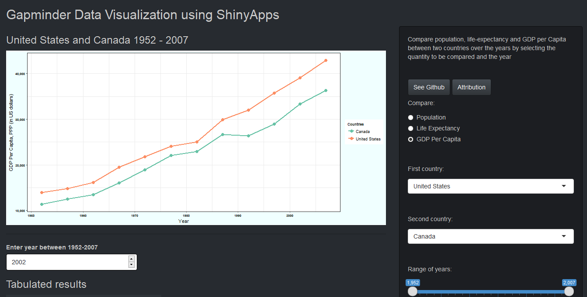
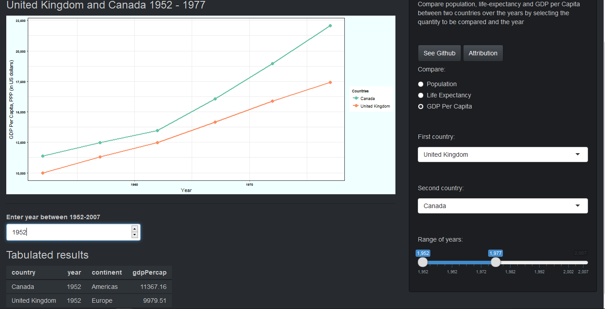

# Week 1 - Shiny Tutorial

This is a documentation of the shiny-app created using Gapminder dataset in R

First, check out the [final product](https://akshi8.shinyapps.io/Gapminder/) that we will be attempting to create.

For more check-out my github repo for more content on this project.

So lets begin,

>  The Default

* By default the countries selected in the app are `United States` and `Canada` and the quantity to be compared is GDP per capita
* Also notice there is a tabulated data space which shows data for the year `2002` by default which can be changed based on the user input
* There are two buttons `See Github` and `Attribution` which takes the user to my github account or the github account of [rebjoh](https://github.com/rebjoh/Gapminder-app) from which this project takes inspiration from

This shiny-app attempts to utilize the following input methods to make it interactive

* Here is a screenshot of the default app setting

> User inputs

* Radio Buttons: to select between Population, Life Expectancy or GDP per capita between the two countries
* Select Input : There are 2 select options to select the countries for comparison
* Slider Input : Years for comparison can be selected by moving the Slider
* Numeric input : The year for which tabulated data has to be displayed can be entered in the input box under the plot based on the years available in the data that is 1952 - 2007 (2002 is default)
* Button input : The buttons  `See Github` and `Attribution` can be pressed to go the links of github accounts for more information

> Change some user inputs

* I have moved the year slider, changed the year entry for tabulated data
* Instead of `United States` I selected `United Kingdom` to compare GDP per capita

> About the app.R

* There are two section of code in app.R file th `ui` and `server`
* UI defines the looks and  interface of the app, themes, layout, inputs etc.
* Server does all the heavy lifting of defining inputs and outputs to the UI based on the plots or tabular data

## So play around the app

* Hope this can help you build your first shiny app as well
